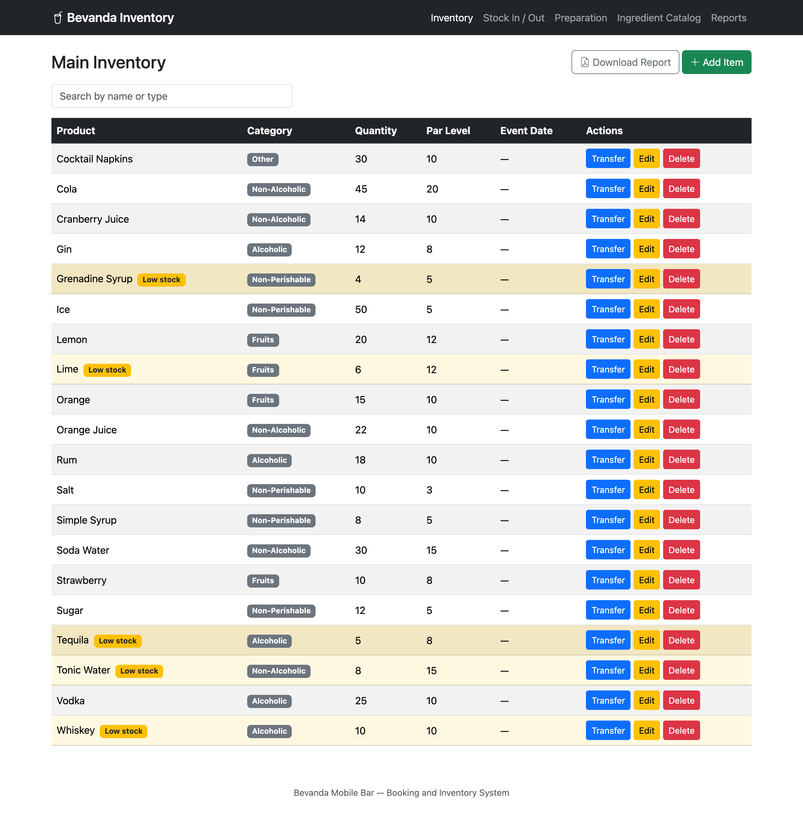
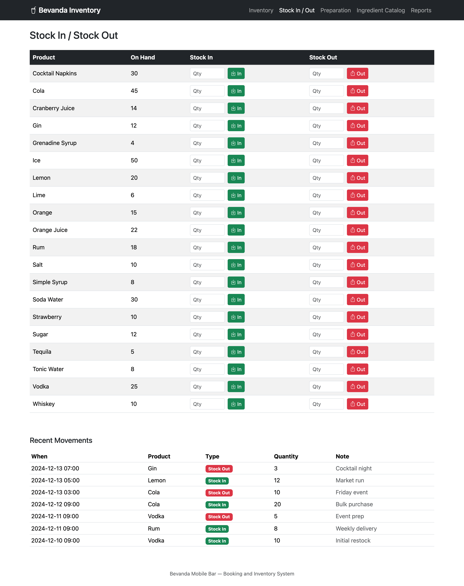
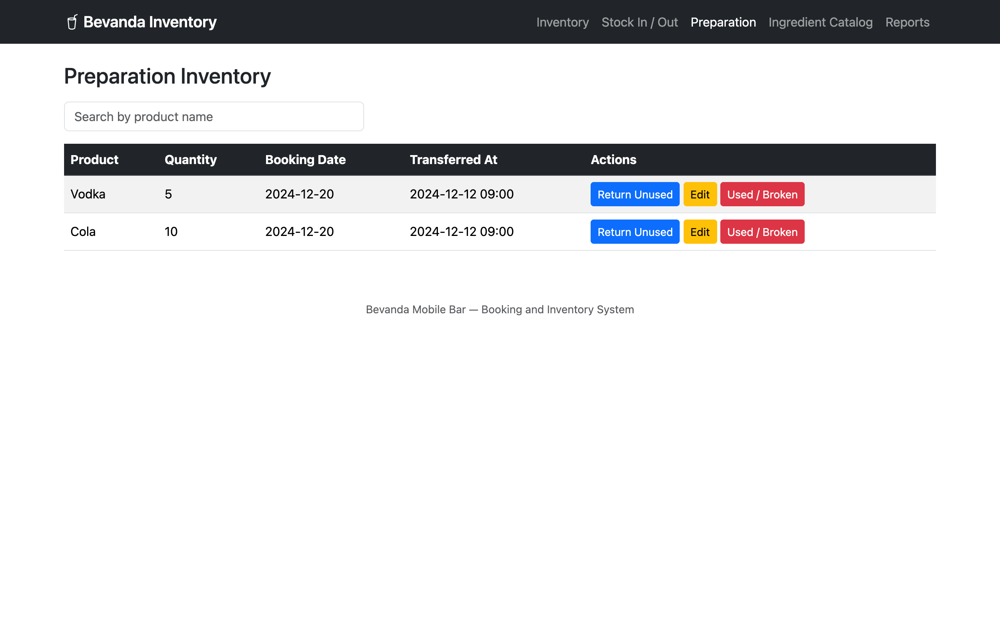
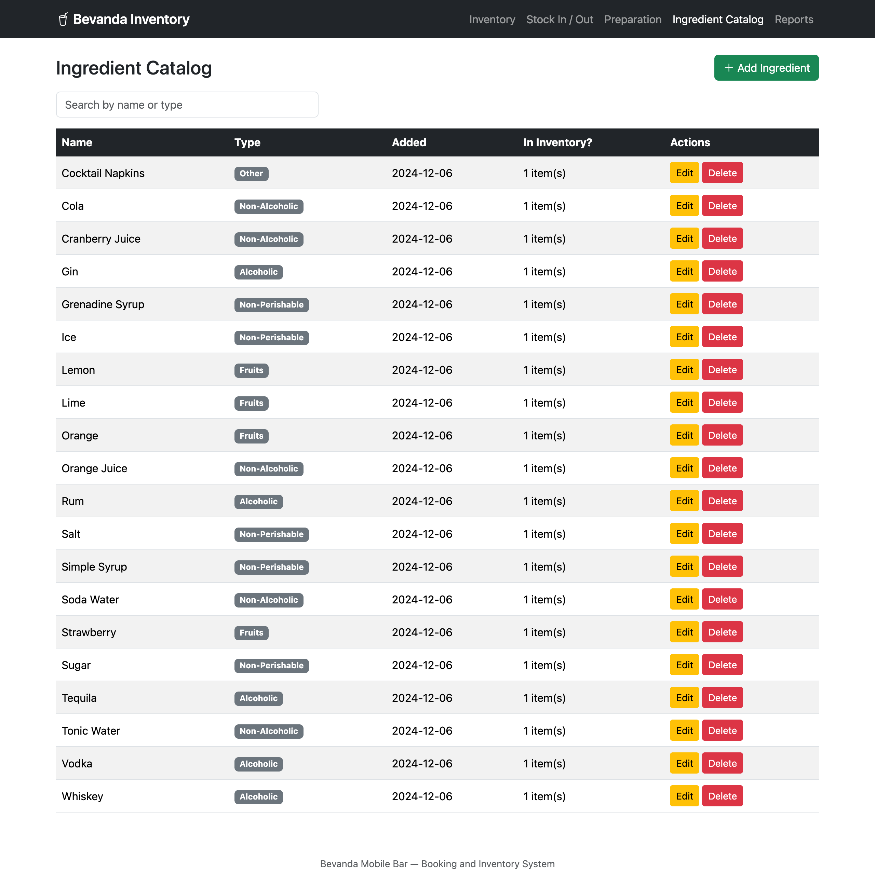
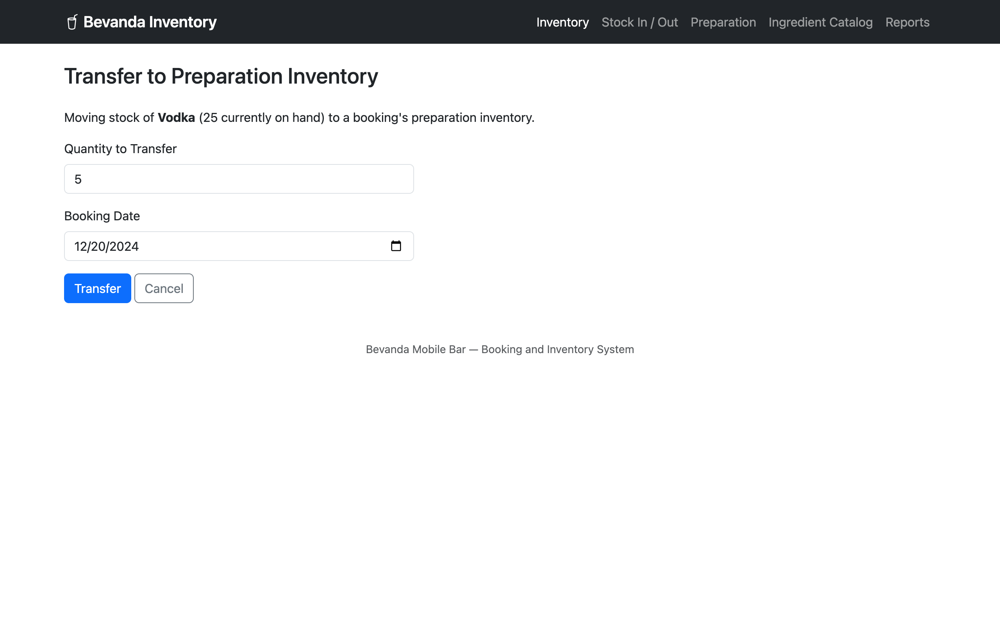
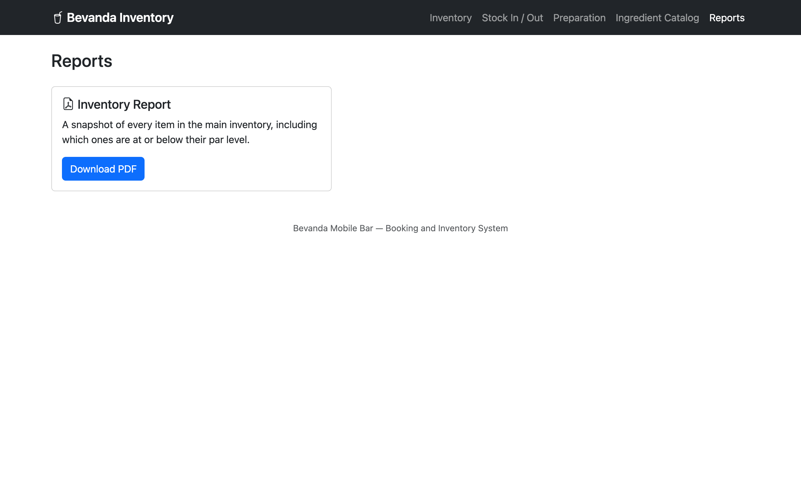

# Bevanda Inventory

Inventory, stock movement, and event-preparation tracking for the
**Bevanda Mobile Bar: Booking and Inventory System**. Staff catalogue what
the bar stocks, move it in and out, and set aside what a booking needs;
every movement is logged and the counts stay reconciled in one place.

Built for **IT Elective 2**, December 2024 — Flask 3 with SQLAlchemy and
SQLite, Jinja2 templates and Bootstrap 5, and ReportLab for the PDF export.
Three modules, each written by a different member of the group, brought
together here on one shared database schema.



## What it does

- **Ingredient Catalog** — the master list of what the bar stocks: name
  and type (alcoholic / non-alcoholic / fruits / non-perishable / other).
- **Main Inventory** — quantity on hand and par (reorder) level per
  ingredient, with a low-stock flag and a PDF export.
- **Stock In / Stock Out** — every stock movement, logged and persisted
  (not held in memory — see [Contributors](docs/CONTRIBUTORS.md) for why
  that distinction matters here).
- **Preparation Inventory** — transfer stock out of the main inventory for
  a booked event date; return what's unused, or deduct what's used,
  broken, or lost.

Use-case actors: **Admin** and **Head Bartender**.

## Screenshots

| Inventory list | Stock in / out | Preparation inventory |
|---|---|---|
|  |  |  |

| Ingredient catalog | Transfer to preparation | Reports |
|---|---|---|
|  |  |  |

## Stack

Python 3.10+, Flask, Flask-SQLAlchemy, Flask-Migrate, SQLite, ReportLab
(PDF export), Bootstrap 5.

## Running it locally

```bash
git clone https://github.com/clarknotkent/IT-Elective-2.git
cd IT-Elective-2
python3 -m venv .venv
source .venv/bin/activate        # Windows: .venv\Scripts\activate
pip install -r requirements.txt

export FLASK_APP=app:create_app  # Windows (PowerShell): $env:FLASK_APP="app:create_app"
flask db upgrade

python seed.py                   # demo data, idempotent — safe to re-run

python app.py                    # http://127.0.0.1:5000/
```

## Running the tests

```bash
pip install pytest
python -m pytest
```

18 tests across the four modules, including regressions for the specific
bugs found in the original submissions (data loss on restart, stock-out
with no upper bound, a delete route that could 500 on a stale id).

## Deploying

See [`docs/DEPLOYMENT.md`](docs/DEPLOYMENT.md) for PythonAnywhere.

## Project layout

```
bevanda-inventory/
├── app.py                 application factory
├── config.py
├── extensions.py          shared db/migrate instances
├── models.py              Ingredient, InventoryItem, StockMovement, PreparationInventory
├── seed.py                demo data for local development
├── blueprints/
│   ├── ingredients/
│   ├── inventory/
│   ├── stock/
│   ├── preparation/
│   └── reports/
├── templates/
├── static/
├── migrations/
├── tests/
├── docs/
│   ├── CONTRIBUTORS.md
│   ├── DEPLOYMENT.md
│   └── screenshots/
└── original-submissions/    each contributor's own submission, kept for the record
    ├── inventory-management/
    ├── ingredient-list/
    ├── stock-in-stock-out/
    └── README.md
```

## Contributors

| Module | Author |
|---|---|
| Inventory Management | James Douglas Ancheta, Kent Elrond Andionne Aspa |
| Ingredient Catalog | Angel Gabriel Litob |
| Stock In / Stock Out | Trisha Ryle Pusta |
| Deployment | Chris Maynard Ampon |
| Unified schema, tests, docs | Kent Elrond Andionne Aspa |

Full detail, including an honest note on one module's third-party
starting point, in [`docs/CONTRIBUTORS.md`](docs/CONTRIBUTORS.md).
