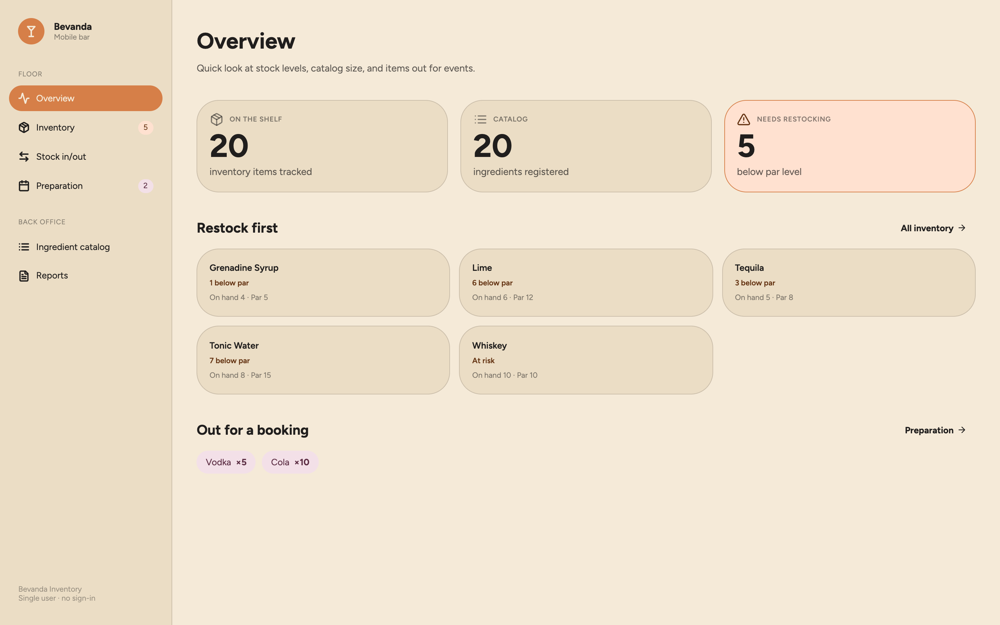
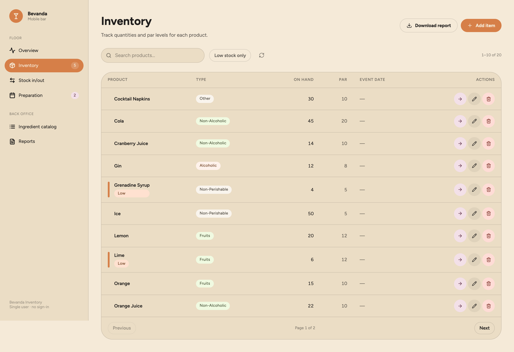
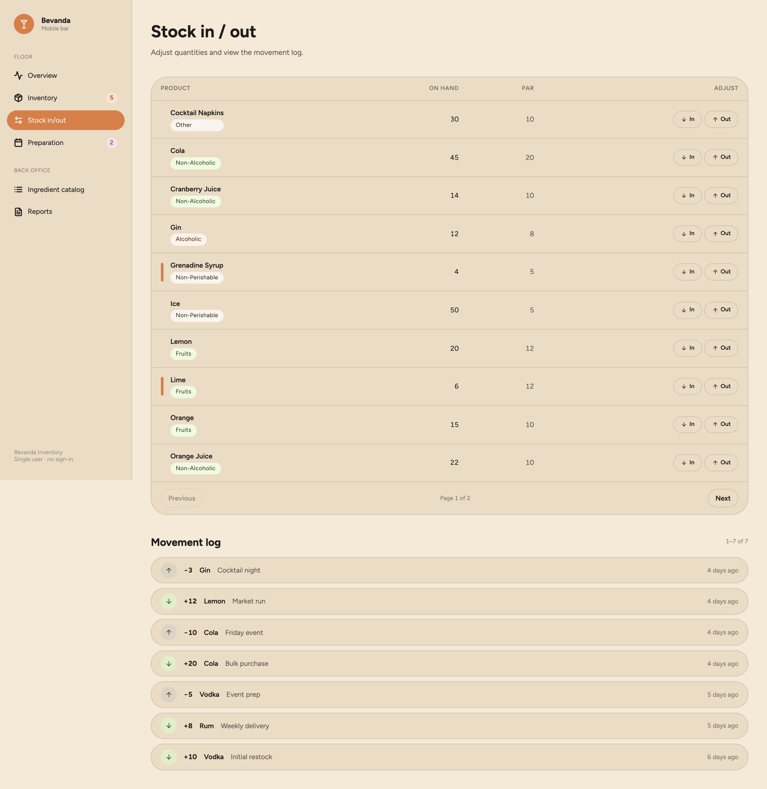

# Bevanda Inventory

Inventory, stock movement, and event-preparation tracking for the
**Bevanda Mobile Bar**. Staff catalogue what the bar stocks, move it in and
out, and set aside what a booking needs; every movement is logged and the
counts stay reconciled in one place.

Built for **IT Elective 2 (Python Web Development)** - IT 3148, January 2025 — a Flask 3 JSON API with
SQLAlchemy and SQLite, and a React 18 single-page frontend in TypeScript,
Tailwind CSS 3 and Vite. The December 2024 group submission this grew out of
is on the [`legacy`](../../tree/legacy) branch.

## Architecture

```
bevanda-inventory/
├── backend/           Flask JSON API (Python)
│   ├── app.py             application factory
│   ├── models.py          SQLAlchemy models
│   ├── blueprints/        API route modules
│   ├── tests/             pytest suite (30 tests)
│   ├── migrations/        Alembic/Flask-Migrate
│   ├── config.py
│   ├── extensions.py
│   └── requirements.txt
├── frontend/          React SPA (TypeScript)
│   ├── src/
│   │   ├── api/           typed API client
│   │   ├── components/    reusable UI components
│   │   ├── context/       React context (toasts)
│   │   ├── pages/         page components per module
│   │   └── types.ts       shared TypeScript types
│   ├── tailwind.config.js
│   ├── postcss.config.js
│   ├── tsconfig.json
│   ├── vite.config.ts
│   └── package.json
└── docs/              contributors, deployment
    └── screenshots/   captured screens
```

The backend and frontend are fully independent — they can be developed,
tested, and deployed separately.

## What it does

- **Ingredient Catalog** — master list of bar stock (name + type).
- **Main Inventory** — quantity on hand and par (reorder) level per item,
  low-stock flagging, PDF report export.
- **Stock In / Stock Out** — every movement logged and persisted.
- **Preparation Inventory** — transfer stock for a booked event; return
  unused, deduct used/broken/lost.

## Screens

### Overview

Stock levels, catalog size, and what's currently out for a booking.



### Inventory

Quantity on hand against par level, with low-stock items flagged.



### Stock in / out

Per-item adjustments above the persisted movement log.



## Running locally (development)

### Backend

```bash
cd backend
python3 -m venv .venv
source .venv/bin/activate
pip install -r requirements.txt

export FLASK_APP=app:create_app
flask db upgrade

# Seed the database with demo data (idempotent, safe to re-run)
python seed.py

python app.py  # API at http://127.0.0.1:5000
```

### Frontend

```bash
cd frontend
npm install
npm run dev    # SPA at http://localhost:5173 (proxies /api to Flask)
```

The Vite dev server proxies `/api` requests to the Flask backend
automatically — no CORS issues in development.

## Running tests

```bash
# Backend
cd backend
source .venv/bin/activate
python -m pytest

# Frontend
cd frontend
npm run build   # type-checks (tsc) and builds
```

## API endpoints

| Method | Endpoint | Description |
|--------|----------|-------------|
| GET | `/api/dashboard` | Stats (counts) |
| GET/POST | `/api/ingredients/` | List / create ingredients |
| PUT/DELETE | `/api/ingredients/<id>` | Update / delete ingredient |
| GET/POST | `/api/inventory/` | List / create inventory items |
| PUT/DELETE | `/api/inventory/<id>` | Update / delete item |
| POST | `/api/inventory/<id>/transfer` | Transfer to preparation |
| GET | `/api/stock/` | List items + recent movements |
| POST | `/api/stock/<id>/in` | Stock in |
| POST | `/api/stock/<id>/out` | Stock out |
| GET | `/api/preparation/` | List preparation transfers |
| PUT/DELETE | `/api/preparation/<id>` | Edit / remove (used/broken) |
| POST | `/api/preparation/<id>/return` | Return unused to inventory |
| GET | `/api/reports/inventory.pdf` | Download PDF report |

## Tech stack

**Backend:** Python 3.10+, Flask, Flask-SQLAlchemy, Flask-Migrate,
Flask-CORS, SQLite, ReportLab (PDF).

**Frontend:** React 18, TypeScript, Vite, Tailwind CSS 3, React Router 7.

## Deployment

Each side deploys independently:

- **Backend** — any Python host (PythonAnywhere, Railway, Render, etc.)
- **Frontend** — any static host (Vercel, Netlify, Cloudflare Pages, etc.)
  pointed at the backend's URL

In production, set the frontend's API base URL via environment variable to
the deployed backend URL.

## License

Released under the MIT License — see [LICENSE](LICENSE).

Coursework for IT Elective 2. See [docs/CONTRIBUTORS.md](docs/CONTRIBUTORS.md)
for per-module authorship.
